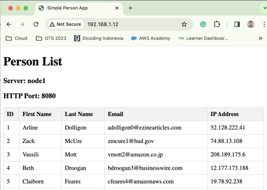

# **Soal Seleksi LKS Komputasi Awal**

SMK Negeri 1 Gombong - 2024
> "Tema: Load Balance Menggunakan NGINX"

## Pelaksanaan

| Hari, tanggal | Jumat, 19 Januari 2024 |
| - | - |
| Waktu | 13.00 WIB s.d. selesai |
| Durasi | 2 Jam |
| Tempat | Lab TKJ SMK Negeri 1 Gombong |

## Alat dan Bahan

1. Komputer dengan minimal memory 4GB
2. Jaringan internet
3. Oracle VirtualBox
4. Image Debian 12 terupdate (disediakan guru)
5. Web browser
6. Terminal
7. Text editor
8. Akun GitHub

## Topologi Jaringan

 

## Tabel Pengalamatan

| No | Perangkat | Network type | IP Address | Subnet Mask | Gateway |
| --- | --- | --- | --- | --- | --- |
| 1 | client | bridge | dhcp client | /24 | - |
| 2 | node0 | bridge | dhcp client | /24 | - |
| 3 | internal 1 | 10.10.1x.254 | /30 | - |
| 5 | internal 2 | 10.10.2x.254 | /30 | - |
| 6 | node1 | internal 1 | 10.10.1x.253 | /30 | - |
| 7 | node2 | internal 2 | 10.10.2x.253 | /30 | - |

Keterangan: x nomor undi

## Spesifikasi

| VPS Compute | VirtualBox VMs |
| --- | --- |
| Node0 | hostname: loadbalancer, http port: 80, cpu: 2 cores, memory: 1024 MB, vga: 16 MB |
| Node1 | hostname: backend1, http port: 8080, cpu: 2 cores, memory: 512 MB, vga: 16 MB |
| Node2 | hostname: backend2, http port: 8081, cpu: 2 cores, memory: 512 MB, vga: 16 MB |
| Operating System | Debian 12, username: debian, password: debian |
| Remote | SSH, Putty |
| Web Server, Load Balancer | NGINX |
| Project Path | /var/www/html/person |
| Database Server | MariaDB, username: root, password: !root1 |
| Networking | CIDR, Bridge (Internet), Internal Network (Private) |
| Programming | PHP (php, php-fpm, php-mysql), SQL Query |
| Version Control, Repository | Git, Github |
| Projek | [https://github.com/anggasmkn1gombong/person](https://github.com/anggasmkn1gombong/StudentCRUD) |

## Instruksi

1. Peserta melakukan konfigurasi infrastruktur jaringan maupun administrasi server untuk men-deploy sebuah projek web
2. Hasil akhir yaitu client dapat mengakses alamat IP loadbalancer
3. Gunakan jaringan internet jika diperlukan untuk mendownload paket aplikasi yang dibutuhkan
5. Atur kredensial sesuai kebutuhan projek web untuk koneksi antara aplikasi dengan database
6. Import file *.sql yang disediakan pada database server agar tersedia dummy record pada tabel database
7. Setelah terkoneksi dengan database server, lengkapi pemrograman pada aplikasi agar data dapat tampil
8. Jika alamat loadbalancer berjalan sesuai ekspektasi, maka web muncul dengan sebagai tabel berikut

   >menampilkan semua record/data pada database bergantian secara random muncul dari backend1 maupun backend2 jika di-refresh secara terus menerus
   
   
   

10. Tambahkan minimal 1 baris data (nama masing-masing) pada tabel database tersebut

   

11. Buatlah repository baru dengan personlist pada GitHub, gunakan untuk mengupload ulang file

   - modifikasi file *.php
   - hasil export file *.sql
   - konfigurasi nginx pada backend1
   - konfigurasi nginx pada backend2
   - konfigurasi nginx pada loadbalancer

## Referensi

1. [Atur alamat statis pada debian](https://itslinuxfoss.com/set-up-static-ip-address-debian-12-linux/)
2. [Atur network pada virtualbox](https://praktekit.com/simulasi-jaringan-internal-network-virtualbox/)
3. [Web server menggunakan nginx](https://www.ditempel.com/2022/12/install-web-server-nginx-di-debian-11.html)
4. [Server block pada nginx](https://www.ditempel.com/2023/01/konfigurasi-server-blocks-nginx-di.html)
5. [Load balancer menggunakan nginx](https://musaamin.web.id/cara-setting-load-balancing-dengan-nginx/)
6. [Membuat tabel dan user pada mariadb](https://medium.com/biji-inovasi/create-dan-grant-user-di-mariadb-d6bfa7a67fc8)
7. [Import dan export database mariadb](https://semigataweb.com/blog/cara-import-eksport-database-di-mysql-dan-mariadb/)
8. [Mariadb diakses dari IP manapun](https://musaamin.web.id/cara-setting-akses-remote-database-mariadb-di-ubuntu/)
9. [Sql query untuk menampilkan data](https://www.duniailkom.com/tutorial-mysql-menampilkan-data-dari-tabel-mysql-select/)
10. [Github dan perintah dasar git](https://www.hostinger.co.id/tutorial/cara-menggunakan-github-perintah-dasar-github)
11. …
12. …
13. …
14. …
15. …
16. …
17. …
18. …
19. …
20. …
